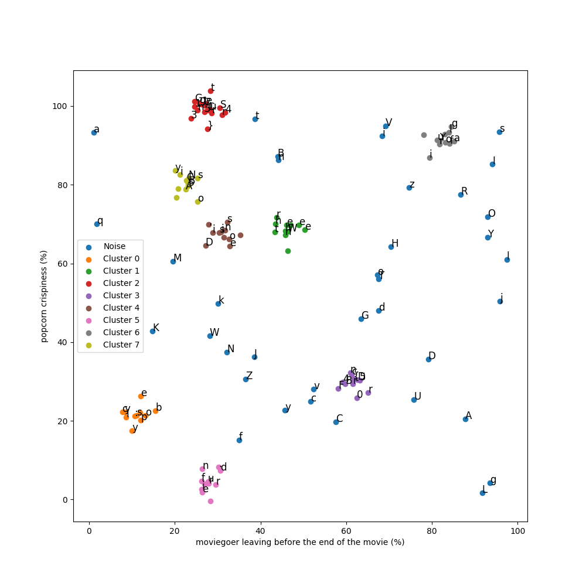

# Étude de Popcorn 2

## Write-up FR

Le challenge est la suite de [Étude de Popcorn](../../Etude%20de%20Popcorn/README.md). Cette fois-ci, les données sont bruitées dont tous les points ne font pas partie d'un cluster. On peut utiliser l'algorithme DBSCAN pour identifier les clusters.

```python
import numpy as np
import pandas as pd
import matplotlib.pyplot as plt
from sklearn.cluster import DBSCAN

# Charger les données
df = pd.read_csv('./files/points.txt')

# Clustering
kmeans = DBSCAN(eps=5)
df['cluster'] = kmeans.fit_predict(df[['x', 'y']])

# Affichage des clusters
plt.figure(figsize=(10, 10))
for cluster_id in df['cluster'].unique():
    cluster_data = df[df['cluster'] == cluster_id]
    plt.scatter(cluster_data['x'], cluster_data['y'], label=f'Cluster {cluster_id}' if cluster_id != -1 else 'Noise')
    for i, row in cluster_data.iterrows():
        plt.text(row['x'], row['y'], row['char'], fontsize=12)

plt.ylabel('popcorn crispiness (%)')
plt.xlabel('moviegoer leaving before the end of the movie (%)')
plt.legend()
plt.savefig('./solution/clusters.png')

# Reconstitution de la phrase
sentence_parts = []

for cluster_id in df['cluster'].unique():
    if cluster_id == -1:
        continue
    cluster_data = df[df['cluster'] == cluster_id]
    cluster_data = cluster_data.sort_values(by='y')
    sentence_parts.append(''.join(cluster_data['char'].values))
    
print(sentence_parts)
```



On a 4 parties de phrase : 

```python
['s: polycybe', 'When there ', 'Clu57er1ng1SGr34t}', 'r{DB5c4nF0r', 'is noise, D', 'ur friend. ', 'Your flag i', 'BSCAN is yo']
```  

Une fois remis dans le bon ordre, on obtient la phrase : 

```plaintext
When there is noise, DBSCAN is your friend. Your flag is: polycyber{DB5c4nF0rClu57er1ng1SGr34t}
```

## Write-up EN

The challenge is a continuation of [Étude de Popcorn](../../Etude%20de%20Popcorn/README.md). This time, the data is noisy and not all points belong to a cluster. We can use the DBSCAN algorithm to identify the clusters.

```python
import numpy as np
import pandas as pd
import matplotlib.pyplot as plt
from sklearn.cluster import DBSCAN

# Charger les données
df = pd.read_csv('./files/points.txt')

# Clustering
kmeans = DBSCAN(eps=5)
df['cluster'] = kmeans.fit_predict(df[['x', 'y']])

# Affichage des clusters
plt.figure(figsize=(10, 10))
for cluster_id in df['cluster'].unique():
    cluster_data = df[df['cluster'] == cluster_id]
    plt.scatter(cluster_data['x'], cluster_data['y'], label=f'Cluster {cluster_id}' if cluster_id != -1 else 'Noise')
    for i, row in cluster_data.iterrows():
        plt.text(row['x'], row['y'], row['char'], fontsize=12)

plt.ylabel('popcorn crispiness (%)')
plt.xlabel('moviegoer leaving before the end of the movie (%)')
plt.legend()
plt.savefig('./solution/clusters.png')

# Reconstitution de la phrase
sentence_parts = []

for cluster_id in df['cluster'].unique():
    if cluster_id == -1:
        continue
    cluster_data = df[df['cluster'] == cluster_id]
    cluster_data = cluster_data.sort_values(by='y')
    sentence_parts.append(''.join(cluster_data['char'].values))
    
print(sentence_parts)
# ['s: polycybe', 'When there ', 'Clu57er1ng1SGr34t}', 'r{DB5c4nF0r', 'is noise, D', 'ur friend. ', 'Your flag i', 'BSCAN is yo']
```
Once put back in the right order, we get the sentence: 

```plaintext
When there is noise, DBSCAN is your friend. Your flag is: polycyber{DB5c4nF0rClu57er1ng1SGr34t}
```


## Flag

`polycyber{DB5c4nF0rClu57er1ng1SGr34t}`
