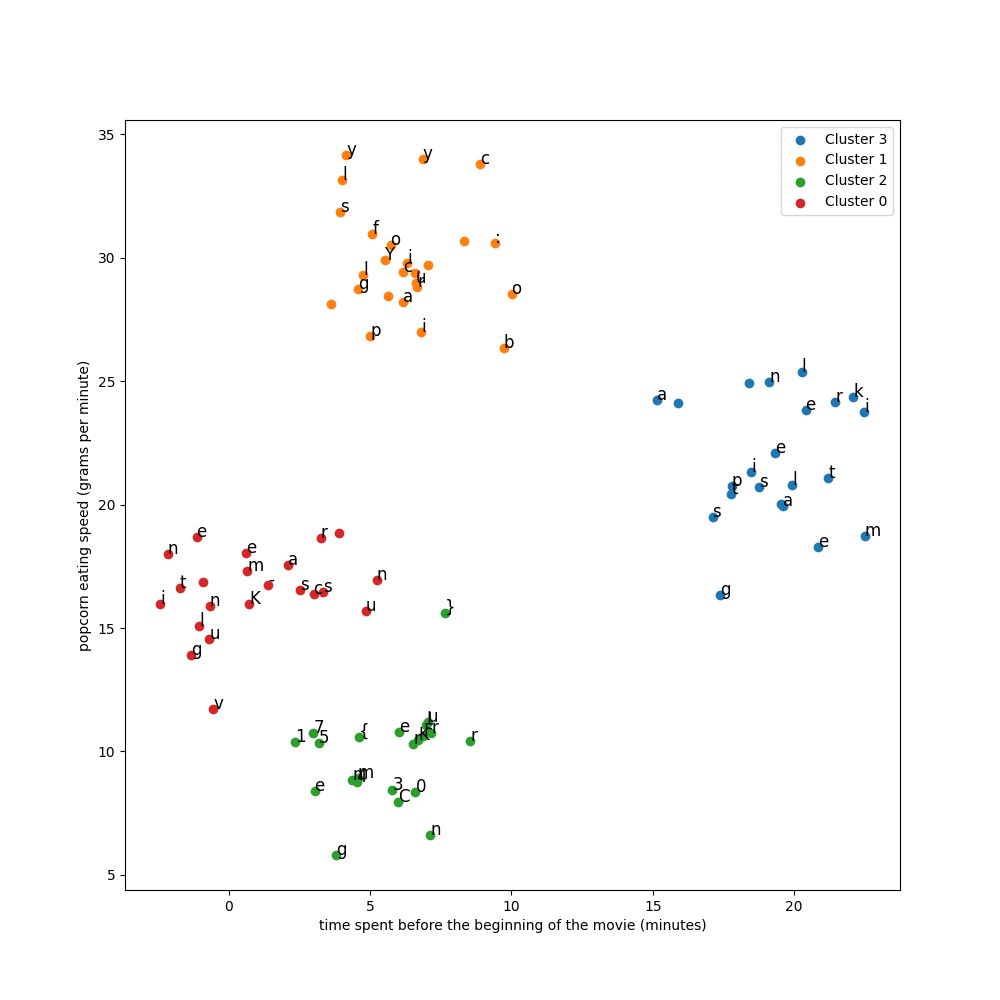

# Étude de Popcorn

## Write-up FR

Le challenge est une introduction à la notion de clustering. Il s'agit de regrouper des données en fonction de leurs caractéristiques.
En faisant un scatter plot des données, on remarque visuellement 4 clusters. On peut utiliser l'algorithme K-means pour les identifier.

Chaque point est associé à une caractère ASCII. En les concaténant, on obtient le flag. Pour connaître l'ordre des points, l'indice du challenge nous aide. Il suffit de trier les points en fonction de leur distance au centre du cluster.

```python
import numpy as np
import pandas as pd
import matplotlib.pyplot as plt
from sklearn.cluster import KMeans

# Charger les données
df = pd.read_csv('./files/points.txt')

# Clustering
kmeans = KMeans(n_clusters=4)
df['cluster'] = kmeans.fit_predict(df[['x', 'y']])

# cluster center
df['center_x'] = kmeans.cluster_centers_[df['cluster'], 0]
df['center_y'] = kmeans.cluster_centers_[df['cluster'], 1]

# Affichage des clusters
plt.figure(figsize=(10, 10))
for cluster_id in df['cluster'].unique():
    cluster_data = df[df['cluster'] == cluster_id]
    plt.scatter(cluster_data['x'], cluster_data['y'], label=f'Cluster {cluster_id}')
    for i, row in cluster_data.iterrows():
        plt.text(row['x'], row['y'], row['char'], fontsize=12)

plt.ylabel('popcorn eating speed (grams per minute)')
plt.xlabel('time spent before the beginning of the movie (minutes)')
plt.legend()
plt.savefig('clusters.png')

# Reconstitution de la phrase
sentence_parts = []

for cluster_id in df['cluster'].unique():
    cluster_data = df[df['cluster'] == cluster_id]
    cluster_data["dist_to_center"] = np.sqrt((cluster_data['x'] - cluster_data['center_x'])**2 + (cluster_data['y'] - cluster_data['center_y'])**2)
    cluster_data = cluster_data.sort_values(by='dist_to_center')
    sentence_parts.append(''.join(cluster_data['char'].values))
    
print(sentence_parts)
```



On a 4 parties de phrase : 

```python
['eils patterns like mag', 'ic. Your flag is: polycyb', 'er{Km34nF0rClu57er1ng}', 'K-means clustering unv']
```  

Une fois remis dans le bon ordre, on obtient la phrase : 

```plaintext
K-means clustering unveils patterns like magic. Your flag is: polycyber{Km34nF0rClu57er1ng}
```

## Write-up EN

The challenge is an introduction to the concept of clustering. It consists in grouping data according to their characteristics.
By making a scatter plot of the data, we visually notice 4 clusters. We can use the K-means algorithm to identify them.

Each point is associated with an ASCII character. By concatenating them, we get the flag. To know the order of the points, the challenge index helps us. It is enough to sort the points according to their distance to the center of the cluster.


We have 4 parts of the sentence: 

```python
['eils patterns like mag', 'ic. Your flag is: polycyb', 'er{Km34nF0rClu57er1ng}', 'K-means clustering unv']
```

Once put back in the right order, we get the sentence: 

```plaintext
K-means clustering unveils patterns like magic. Your flag is: polycyber{Km34nF0rClu57er1ng}
```

## Flag

`polycyber{Km34nF0rClu57er1ng}`