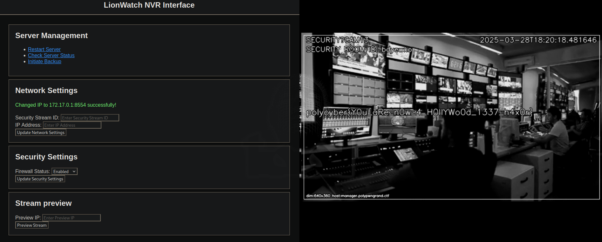

# Ocean's 2

While on this stream, a hostname is written on the bottom right:
```
manager.polypwngrand.ctf
```

Adding this URL in our `hosts` file, we can see a new web interface for the NVR interface of the cameras.

By using the same credentials as before, we are able to login to the service.

From there we can navigate to the CAMS tab (`/cams`) and we can see that we have two cameras available. One of which is the slots machine we previously saw.

By connecting to the other stream, we can notice some leaked credentials on the employee's desktop before it gets destroyed.

The desktop displays:
```
Login Notes
it
K7Hn1rPQouU
```

By using those credentials on the website, we gain access to a new panel and a new camera.

This new camera shows an ID as well. We can also see what seems to be a stream being streamed on the computer in the stream. By going back to the panel, we can see that the configuration page (`/config`) exposes a 'Network settings' panel.


By connecting to the security stream via RTSP, and entering the ID shown on the stream on the page with a random IP address, we can see that the screen goes green/gray and the text "SECURITY BREACH" shows.

We can then try to understand what's happening by starting a netcat listener and inputting our own IP addressand port into the IP address field. The netcat listener will show something like this upon a connection:
```
OPTIONS rtsp://172.21.0.1:9090/vault.rtsp RTSP/1.0
CSeq: 1
User-Agent: GStreamer/1.24.9
Date: Sun, 23 Mar 2025 19:02:11 GMT

```

We can see that it is trying to connect to an RTSP stream on the given address/port combination. Also, since the "SECURITY BREACH" popup seems to appear when motion is detected on the stream, we should try to loop the video that was previously there.

Unfortunately, if we try to connect to vault.rtsp with the `it` account, it fails, as it doesn't have permission to view the stream.
However, going back to the panel, we can try to understand how the preview feature of the website works.

Each time the page is reloaded, previews are obtained from: `http://manager.polypwngrand.ctf/cams?id=<ID>`.
If we try to brute force the IDs in Burp or manually, we can find that a few of them return results, including the ID `1`. The ID `1` seems to correspond to what we see on stream when we connect.

Using this IDOR, we can leak the image we should loop on stream. To have our own RTSP server up and running, we can search "Simple RTSP server" on Google and end up with different solutions. MediaMTX or GStreamer would be good otpions.

For the sake of this writeup, I will use [this script](https://github.com/viniciusarruda/rtsp-server/blob/main/main.py).

Using the leaked image from `http://manager.polypwngrand.ctf/cams?id=1`, we can then construct an MP4 that will loop the same frame constantly and stream it with GStreamer.

We can also create an MP4 of the screenshot from the stream with this command:
`ffmpeg -loop 1 -i v.jpg -c:v libx264 -t 30 -y vault_static.mp4`

Doing this, we can replace the stream with our own, and after a while of viewing the stream, the flag should appear:
