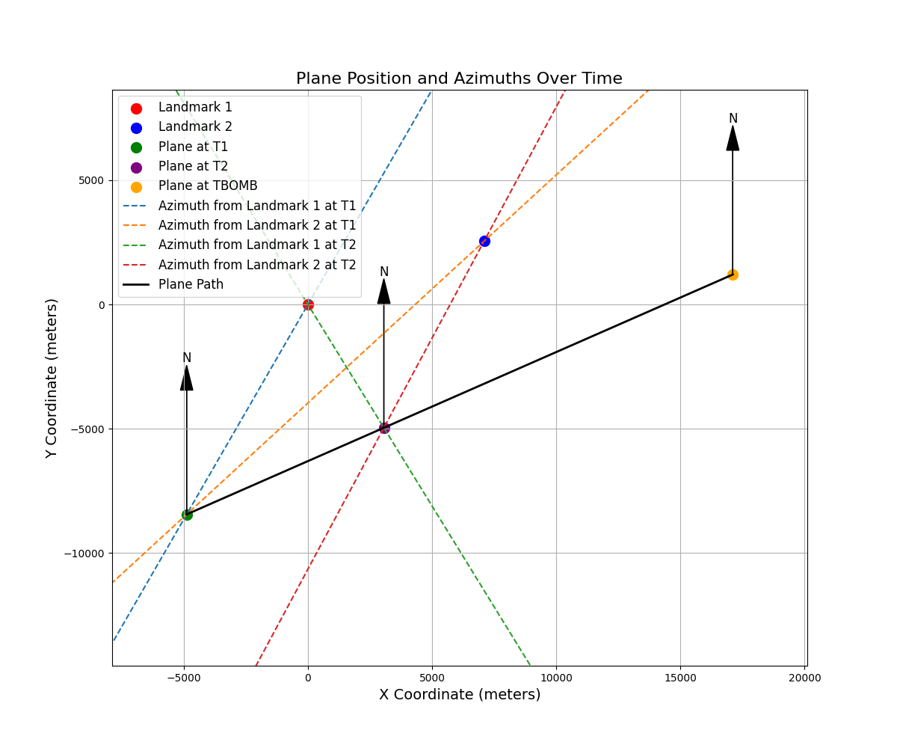

# SherlHack 2

## Write-up FR

### Étape 1 : Compréhension des données fournies

Les données fournies sont les suivantes :

- **Temps T1** : 29 MAR 2025 21:34:00  
  - landmark A : (45.50394422783684, -73.62675236294805) — Azimut 30.04°  
  - landmark B : (45.52688057562694, -73.53571295727556) — Azimut 47.45°  

- **Temps T2** : 29 MAR 2025 21:36:10  
  - landmark A : (45.50394422783684, -73.62675236294805) — Azimut 328.35°  
  - landmark B : (45.52688057562694, -73.53571295727556) — Azimut 28.26°  

- **Temps du largage de la bombe (TBOMB)** : 29 MAR 2025 21:40:00  

Notre objectif est de calculer la position de l'avion au temps TBOMB.

---

### Étape 2 : Conversion des coordonnées GPS en coordonnées cartésiennes

Pour faciliter les calculs, nous convertissons les coordonnées GPS des landmarks en coordonnées cartésiennes en utilisant une projection locale.

```python
import math

# Define constants
R = 6371000  # Radius of the Earth in meters

# Coordinates of landmarks in degrees
landmark1_lat_deg = 45.50394422783684
landmark1_lon_deg = -73.62675236294805
landmark2_lat_deg = 45.52688057562694
landmark2_lon_deg = -73.53571295727556

# Convert coordinates to radians
lat1 = math.radians(landmark1_lat_deg)
lon1 = math.radians(landmark1_lon_deg)
lat2 = math.radians(landmark2_lat_deg)
lon2 = math.radians(landmark2_lon_deg)

# Reference point (origin)
lat0, lon0 = lat1, lon1

# Calculate differences for cartesian coordinates
dx = R * (lon2 - lon1) * math.cos(lat0)
dy = R * (lat2 - lat1)

# Landmarks in cartesian coordinates
# We arbitrarily set the first landmark as the origin (0, 0)
# Works also if we set anything else as the origin (but make sure lat0, lon0 are set accordingly)

landmark1 = (0, 0)
landmark2 = (dx, dy)

print(f"Landmark 1 is at {landmark1}")
print(f"Landmark 2 is at {landmark2}")
# Landmark 1 is at (0, 0)
# Landmark 2 is at (7094.891554595631, 2550.405510014657)

# To compute the reverse transformation.
def cartesian_to_gps(x, y):
    # Conversion des coordonnées cartésiennes en GPS
    lon = lon0 + (x / (R * math.cos(lat0)))
    lat = lat0 + (y / R)
    # Conversion en degrés
    lat_deg = math.degrees(lat)
    lon_deg = math.degrees(lon)
    return lat_deg, lon_deg

```


### Étape 3 : Calcul de la position de l'avion à T1 via triangulation

#### Principe de la triangulation

La triangulation permet de déterminer la position d'un point en utilisant les angles (azimuts) depuis deux points de référence connus. En traçant les droites correspondant aux directions des azimuts depuis chaque landmark, leur intersection donne la position de l'avion.

#### Calculs
```python
# Azimuth angles
azimuth_land1_t1 = 30.04 # degrees
azimuth_land2_t1 = 47.45 # degrees
# Calculate the slopes of the lines
# tan(theta) = dy/dx
dx_on_dy_1_t1 = math.tan(math.radians(90 - azimuth_land1_t1))
dx_on_dy_2_t1 = math.tan(math.radians(90 - azimuth_land2_t1))

# Calculate the y-intercepts
# y = ax + b => b = y - ax
y_intercept1_t1 = landmark1[1] - dx_on_dy_1_t1 * landmark1[0]
y_intercept2_t1 = landmark2[1] - dx_on_dy_2_t1 * landmark2[0]

# Calculate the intersection point
# ax + b = cx + d => x = (d - b) / (a - c)
x_t1 = (y_intercept2_t1 - y_intercept1_t1) / (dx_on_dy_1_t1 - dx_on_dy_2_t1)
y_t1 = dx_on_dy_1_t1 * x_t1 + y_intercept1_t1
plane_t1 = (x_t1, y_t1)

print(f"Plane position at T1: {plane_t1} or {carthesian_to_gps(x_t1, y_t1)}")
# Plane position at T1: (-4883.70264669701, -8445.199711378367) or (45.42799472216942, -73.68941849153018)
```
### Étape 4 : Calcul de la position de l'avion à T2 via triangulation
Nous répétons les mêmes calculs pour déterminer la position de l'avion à T2.

```python
# Azimuts à T2
azimuth_land1_t2 = 328.35  # degrés
azimuth_land2_t2 = 28.26   # degrés

# Calculate the slopes of the lines
# tan(theta) = dy/dx
dx_on_dy_1_t2 = math.tan(math.radians(90 - azimuth_land1_t2))
dx_on_dy_2_t2 = math.tan(math.radians(90 - azimuth_land2_t2))

# Calculate the y-intercepts
# y = ax + b => b = y - ax
y_intercept1_t2 = landmark1[1] - dx_on_dy_1_t2 * landmark1[0]
y_intercept2_t2 = landmark2[1] - dx_on_dy_2_t2 * landmark2[0]

# Calculate the intersection point
# ax + b = cx + d => x = (d - b) / (a - c)
x_t2 = (y_intercept2_t2 - y_intercept1_t2) / (dx_on_dy_1_t2 - dx_on_dy_2_t2)
y_t2 = dx_on_dy_1_t2 * x_t2 + y_intercept1_t2
plane_t2 = (x_t2, y_t2)

print(f"Plane position at T2: {plane_t2} or {carthesian_to_gps(x_t2, y_t2)}")
# Plane position at T2: (3057.5603320122555, -4960.289009136619) or (45.45933527706166, -73.58751871528872)
```

### Étape 5 : Calcul de la trajectoire de l'avion et projection à l'heure du largage de la bombe

Nous disposons maintenant des positions de l'avion à deux instants différents. Nous pouvons calculer la vitesse de l'avion et extrapoler sa position à l'heure du largage de la bombe.

```python
import time
# Define times
T1 = time.mktime(time.strptime("29 MAR 2025 21:34:00", "%d %b %Y %H:%M:%S"))
T2 = time.mktime(time.strptime("29 MAR 2025 21:36:10", "%d %b %Y %H:%M:%S"))
TBOMB = time.mktime(time.strptime("29 MAR 2025 21:40:00", "%d %b %Y %H:%M:%S"))

# Time differences in seconds
T1_rel = 0  # Reference time
T2_rel = T2 - T1
TBOMB_rel = TBOMB - T1

# Conversion des temps en secondes depuis l'époque
# Calculate the distance and speed
distance = math.hypot(x_t2 - x_t1, y_t2 - y_t1)
time_interval = T2_rel - T1_rel

# Calculate total time from T1 to TBOMB
total_time = TBOMB_rel - T1_rel

# Calculate the plane's position at TBOMB
ratio = total_time / time_interval
x_bomb = x_t1 + (x_t2 - x_t1) * ratio
y_bomb = y_t1 + (y_t2 - y_t1) * ratio
plane_bomb = (x_bomb, y_bomb)

print(f"Plane position at TBOMB: {plane_bomb} or {carthesian_to_gps(x_bomb, y_bomb)}")
# Plane position at TBOMB: (17107.48714049788, 1205.32223329109) or (45.51478395110177, -73.40723449578462)

# Alternative method :
speed = distance / time_interval
distance_bomb = speed * (TBOMB_rel - T1_rel)
sin_angle = (y_t2 - y_t1) / distance
cos_angle = (x_t2 - x_t1) / distance
x_bomb_2 = x_t1 + distance_bomb * cos_angle
y_bomb_2 = y_t1 + distance_bomb * sin_angle

assert math.isclose(x_bomb, x_bomb_2, rel_tol=1e-9)
assert math.isclose(y_bomb, y_bomb_2, rel_tol=1e-9)
```

### Visualisation

Nous pouvons visualiser les landmarks, la position de l'avion à T1, T2 et TBOMB sur une carte.


### Conclusion

Le flag est la position de l'avion à TBOMB en coordonnées GPS arrondie à 2 décimales près.
- Latitude : 45.51
- Longitude : -73.41

## Write-up EN

### Step 1: Understanding the Provided Data

The provided data is as follows:

- **Time T1**: 29 MAR 2025 21:34:00  
  - landmark A: (45.50394422783684, -73.62675236294805) — Azimuth 30.04°  
  - landmark B: (45.52688057562694, -73.53571295727556) — Azimuth 47.45°  

- **Time T2**: 29 MAR 2025 21:36:10  
  - landmark A: (45.50394422783684, -73.62675236294805) — Azimuth 328.35°  
  - landmark B: (45.52688057562694, -73.53571295727556) — Azimuth 28.26°  

- **Bomb Drop Time (TBOMB)**: 29 MAR 2025 21:40:00  

Our goal is to calculate the plane's position at TBOMB.

---

### Step 2: Converting GPS Coordinates to Cartesian Coordinates

To simplify the calculations, we convert the GPS coordinates of the landmarks into Cartesian coordinates using a local projection.

```python
import math

# Rayon de la Terre en mètres
R = 6371000  

# Coordonnées GPS des landmarks en degrés
landmark1_lat_deg = 45.50394422783684
landmark1_lon_deg = -73.62675236294805
landmark2_lat_deg = 45.52688057562694
landmark2_lon_deg = -73.53571295727556

# Conversion en radians
lat1 = math.radians(landmark1_lat_deg)
lon1 = math.radians(landmark1_lon_deg)
lat2 = math.radians(landmark2_lat_deg)
lon2 = math.radians(landmark2_lon_deg)

# Point de référence pour la projection (landmark 1)
lat0, lon0 = lat1, lon1

# Calcul des différences pour la projection en coordonnées cartésiennes
dx = R * (lon2 - lon1) * math.cos(lat0)
dy = R * (lat2 - lat1)

# Coordonnées cartésiennes des landmarks
landmark1 = (0, 0)  # Point de référence
landmark2 = (dx, dy)

print(f"landmark 1 en coordonnées cartésiennes : {landmark1}")
print(f"landmark 2 en coordonnées cartésiennes : {landmark2}")
# Landmark 1 is at (0, 0)
# Landmark 2 is at (7094.891554595631, 2550.405510014657)

# To compute the reverse transformation.
def cartesian_to_gps(x, y):
    # Conversion des coordonnées cartésiennes en GPS
    lon = lon0 + (x / (R * math.cos(lat0)))
    lat = lat0 + (y / R)
    # Conversion en degrés
    lat_deg = math.degrees(lat)
    lon_deg = math.degrees(lon)
    return lat_deg, lon_deg
```

### Step 3: Calculating the Plane's Position at T1 via Triangulation

#### Principle of Triangulation

Triangulation is used to determine the position of a point based on angles (azimuths) from two known reference points. By tracing the lines corresponding to the azimuth directions from each landmark, their intersection gives the plane's position.

#### Calculations
    
```python
# Azimuth angles
azimuth_land1_t1 = 30.04 # degrees
azimuth_land2_t1 = 47.45 # degrees
# Calculate the slopes of the lines
# tan(theta) = dy/dx
dx_on_dy_1_t1 = math.tan(math.radians(90 - azimuth_land1_t1))
dx_on_dy_2_t1 = math.tan(math.radians(90 - azimuth_land2_t1))

# Calculate the y-intercepts
# y = ax + b => b = y - ax
y_intercept1_t1 = landmark1[1] - dx_on_dy_1_t1 * landmark1[0]
y_intercept2_t1 = landmark2[1] - dx_on_dy_2_t1 * landmark2[0]

# Calculate the intersection point
# ax + b = cx + d => x = (d - b) / (a - c)
x_t1 = (y_intercept2_t1 - y_intercept1_t1) / (dx_on_dy_1_t1 - dx_on_dy_2_t1)
y_t1 = dx_on_dy_1_t1 * x_t1 + y_intercept1_t1
plane_t1 = (x_t1, y_t1)

print(f"Plane position at T1: {plane_t1} or {carthesian_to_gps(x_t1, y_t1)}")
# Plane position at T1: (-4883.70264669701, -8445.199711378367) or (45.42799472216942, -73.68941849153018)
```

### Step 4: Calculating the Plane's Position at T2 via Triangulation

We repeat the same calculations to determine the plane's position at T2.

```python
# Azimuts à T2
azimuth_land1_t2 = 328.35  # degrés
azimuth_land2_t2 = 28.26   # degrés

# Calculate the slopes of the lines
# tan(theta) = dy/dx
dx_on_dy_1_t2 = math.tan(math.radians(90 - azimuth_land1_t2))
dx_on_dy_2_t2 = math.tan(math.radians(90 - azimuth_land2_t2))

# Calculate the y-intercepts
# y = ax + b => b = y - ax
y_intercept1_t2 = landmark1[1] - dx_on_dy_1_t2 * landmark1[0]
y_intercept2_t2 = landmark2[1] - dx_on_dy_2_t2 * landmark2[0]

# Calculate the intersection point
# ax + b = cx + d => x = (d - b) / (a - c)
x_t2 = (y_intercept2_t2 - y_intercept1_t2) / (dx_on_dy_1_t2 - dx_on_dy_2_t2)
y_t2 = dx_on_dy_1_t2 * x_t2 + y_intercept1_t2
plane_t2 = (x_t2, y_t2)

print(f"Plane position at T2: {plane_t2} or {carthesian_to_gps(x_t2, y_t2)}")
# Plane position at T2: (3057.5603320122555, -4960.289009136619) or (45.45933527706166, -73.58751871528872)
```

### Step 5: Calculating the Plane's Trajectory and Projecting to the Bomb Drop Time

Now that we have the plane's positions at two different times, we can calculate its speed and extrapolate its position at the bomb drop time.

```python
import time
# Define times
T1 = time.mktime(time.strptime("29 MAR 2025 21:34:00", "%d %b %Y %H:%M:%S"))
T2 = time.mktime(time.strptime("29 MAR 2025 21:36:10", "%d %b %Y %H:%M:%S"))
TBOMB = time.mktime(time.strptime("29 MAR 2025 21:40:00", "%d %b %Y %H:%M:%S"))

# Time differences in seconds
T1_rel = 0  # Reference time
T2_rel = T2 - T1
TBOMB_rel = TBOMB - T1

# Conversion des temps en secondes depuis l'époque
# Calculate the distance and speed
distance = math.hypot(x_t2 - x_t1, y_t2 - y_t1)
time_interval = T2_rel - T1_rel

# Calculate total time from T1 to TBOMB
total_time = TBOMB_rel - T1_rel

# Calculate the plane's position at TBOMB
ratio = total_time / time_interval
x_bomb = x_t1 + (x_t2 - x_t1) * ratio
y_bomb = y_t1 + (y_t2 - y_t1) * ratio
plane_bomb = (x_bomb, y_bomb)

print(f"Plane position at TBOMB: {plane_bomb} or {carthesian_to_gps(x_bomb, y_bomb)}")
# Plane position at TBOMB: (17107.48714049788, 1205.32223329109) or (45.51478395110177, -73.40723449578462)

# Alternative method :
speed = distance / time_interval
distance_bomb = speed * (TBOMB_rel - T1_rel)
sin_angle = (y_t2 - y_t1) / distance
cos_angle = (x_t2 - x_t1) / distance
x_bomb_2 = x_t1 + distance_bomb * cos_angle
y_bomb_2 = y_t1 + distance_bomb * sin_angle

assert math.isclose(x_bomb, x_bomb_2, rel_tol=1e-9)
assert math.isclose(y_bomb, y_bomb_2, rel_tol=1e-9)
```

### Visualization

We can visualize the landmarks, the plane's positions at T1, T2, and TBOMB on a map.


### Conclusion

The flag is the plane's position at TBOMB in GPS coordinates, rounded to two decimal places:
- Latitude : 45.51
- Longitude : -73.41

## Flag

`polycyber{45.51,-73.41}`


