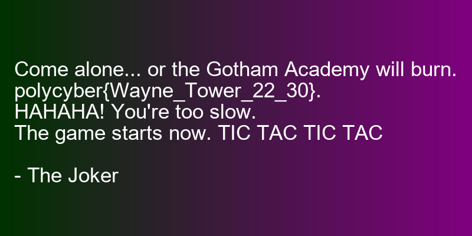

# UnmASK the Joker

## Write-up FR

Ce challenge de radiofréquence permet d'introduire la modulation ASK. C'est une modulation en amplitude, c'est-à-dire que l'information est encodée sur l'amplitude du signal. Pour ce challenge, ce signal est une image PNG dont on encode les octets du fichier.

En affichant le signal, on remarque qu'il prend des valeurs entre 0 et 1 (après normalisation par la valeur maximale des entiers pour le format .wav, qui est en int16). Le signal encode des bytes (valeurs entre 0 et 255), il faut donc renormaliser le signal pour obtenir les bonnes amplitudes.

Enfin, à cause des erreurs d'arrondis dues à python, il faut utiliser la fonction `np.ceil` pour obtenir la bonne valeur. On peut le remarquer car les premiers octets sont `b'\x88OMF\x0c\t\x19\t\x00\x00\x00\x0cHGC'` au lieu de `b'\x89PNG\r\n\x1a\n\x00\x00\x00\rIHD'`. On peut enfin sauvegarder l'image comme un fichier binaire, pour observer le message.

```python
from scipy.io.wavfile import read
import numpy as np

sample_rate, signal = read("output_signal.wav")
symbole_rate = 50e3

signal = 255 * signal.astype(np.float64) / np.iinfo(signal.dtype).max

binary_data = b''
n_symbol = int(sample_rate/symbole_rate)
for i in range(0, len(signal), n_symbol):
    binary_data += bytes([int(np.ceil(np.max(signal[i:i+n_symbol])))])

with open('decoded.png', 'wb') as file:
    file.write(binary_data)
```

On obtient alors l'image :



## Write-up EN

This radio frequency challenge introduces ASK modulation. This is amplitude modulation, meaning that the information is encoded on the amplitude of the signal. For this challenge, the signal is a PNG image with the bytes of the file encoded.

If you display the signal, you can see that it takes values between 0 and 1 (after normalisation by the maximum integer value for the .wav format, which is int16). The signal encodes bytes (values between 0 and 255), so it needs to be renormalised to obtain the correct amplitudes.

Finally, because of rounding errors due to python, you need to use the `np.ceil` function to get the right value. You can see this because the first bytes are `b‘\x88OMF\x0c\tx19\tx00\x00\x0cHGC’` instead of `b‘\x89PNG\r\n\x1a\n\x00\x00\rIHD’`. Finally, you can save the image as a binary file, to observe the message.

This produces the image :


## Flag

`polycyber{Wayne_Tower_22_30}`
