# Hooty's Hexed Hiccups

## Write-up FR

Ce défi était inspiré de vrais problèmes que j'ai rencontrés lors d'un projet de programmation, où il fallait construire des images à partir de données cartographiques binaires. Nos images étaient en bitmap, et j'avais de nombreux problèmes de format et d'affichage en créant les images!

Le thème de "The Owl House" a simplement été mis puisque j'aime beaucoup cette série :)

La principale source de problème était la validité de l'en-tête des images bitmap (.bmp). Je vous encourage à regarder la page Wikipédia des images bitmap pour voir les détails:

https://en.wikipedia.org/wiki/BMP_file_format#DIB_header_(bitmap_information_header)

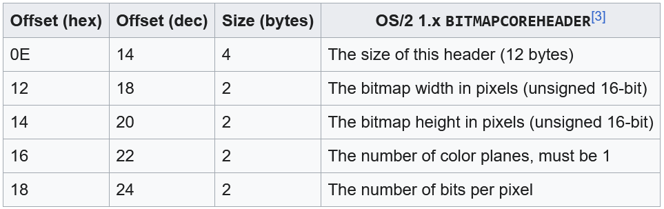

Comme indiqué par l'indice, les 2 premières images servaient d'entraînement pour découvrir les "erreurs" dans les métadonnées de l'en-tête des images, qu'il fallait ensuite reproduire sur l'image 3 qui cachait le flag.

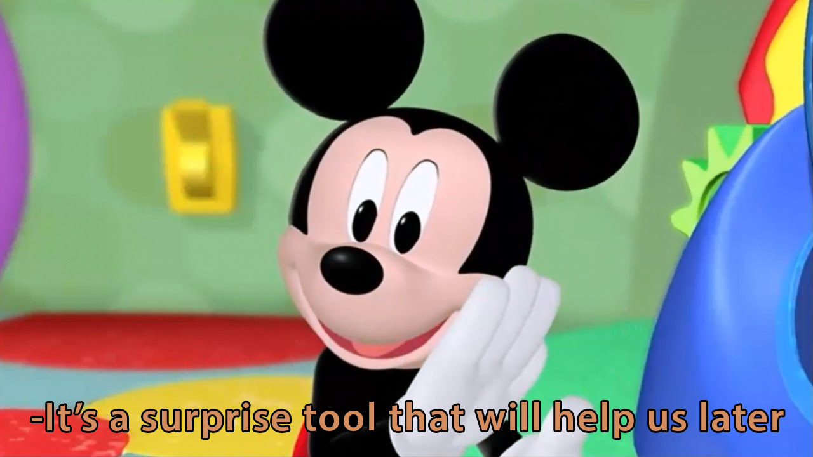

### Image 1 - Bits par pixel (*bit depth*)

Pour montrer le processus de correction, j'ai utilisé l'éditeur hexadécimal de VSCode.

Voici comment faire:

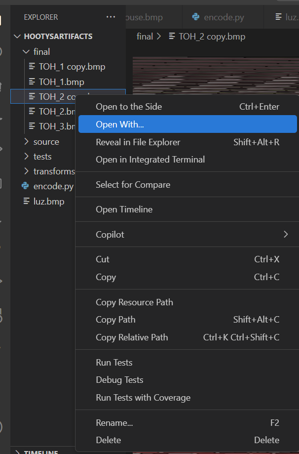

Puis:

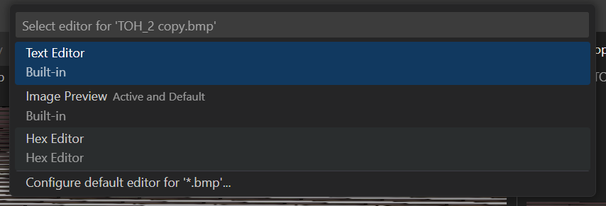

Pour trouver la première étape, il fallait observer que les couleurs ont de gros "contrastes", ou bien comprendre le header de bitmap et tester différents changements!

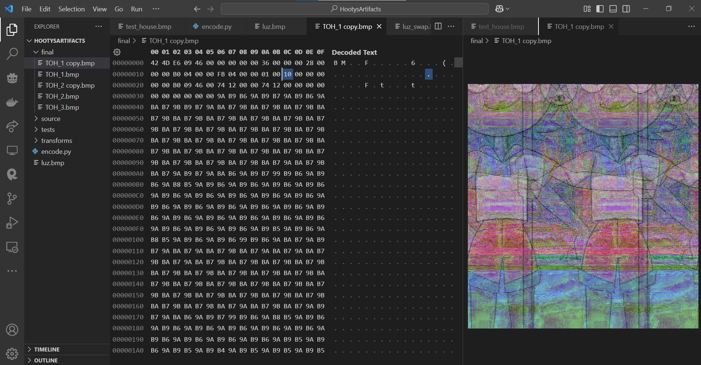

L'octet déterminant le nombre de bits par pixel (*bit depth*) était à 0x10, donc 16 bits par pixel. Cela explique pourquoi il n'y a pas autant de couleurs "graduelles" comme les images 24 bits plus communes.

En essayant de changer le bit depth, nous verrons que parmi les *bit depth* standards c'est 24 bit qui fonctionne, soit 0x18, et on retrouve l'image originale!

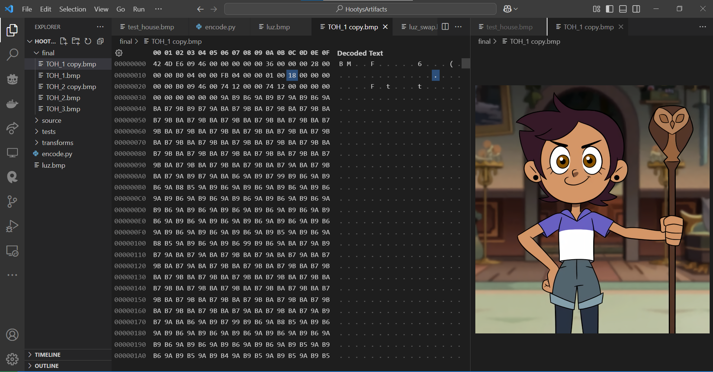

### Image 2 - Taille d'image

La deuxième image, quant à elle, ne présentait pas de couleurs trop "contrastées"/"saturées". Cependant, les lignes ne semblent pas être alignées...

En fait le problème ici était un mauvaise taille, puisqu'on a tous les pixels mais le header cause un mauvais affichage. La solution était d'inverser la longueur et la hauteur de l'image, aux positions suivantes de l'en-tête

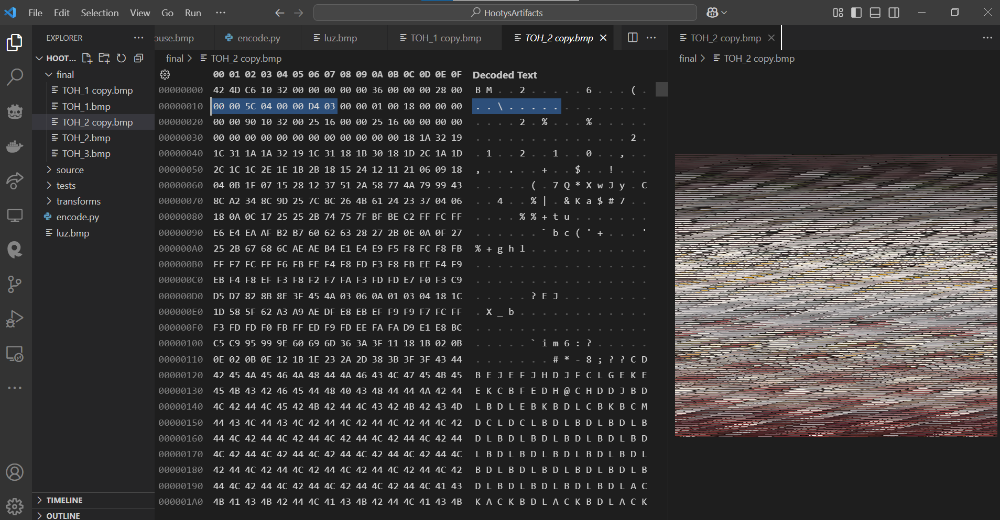

Qui devenait :

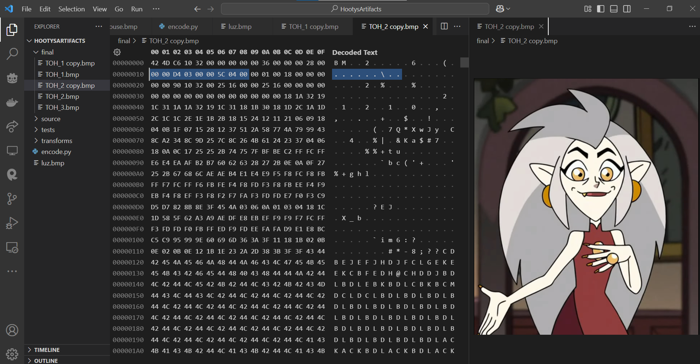

(Attention à l'affichage des octets en *little endian* ou "petit-boutisme"!)

### Image 3 - Mélanger le tout et déceler le secret

Enfin, la dernière image avait aussi un problème de bit depth (qui était à 8, donc les couleurs étaient encore moins diversifiées).

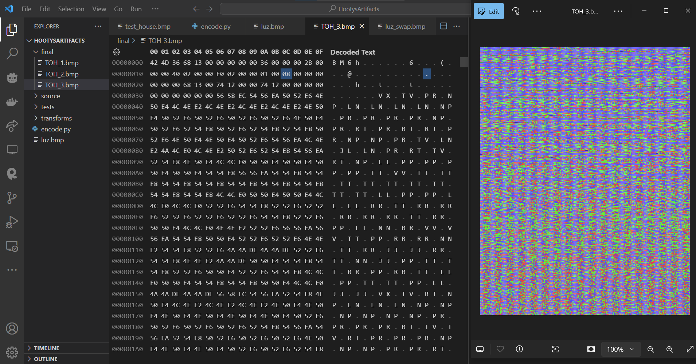

Comme l'image 1, nous remettons le bit depth à 24 (0x18), et nous avons l'image suivante:

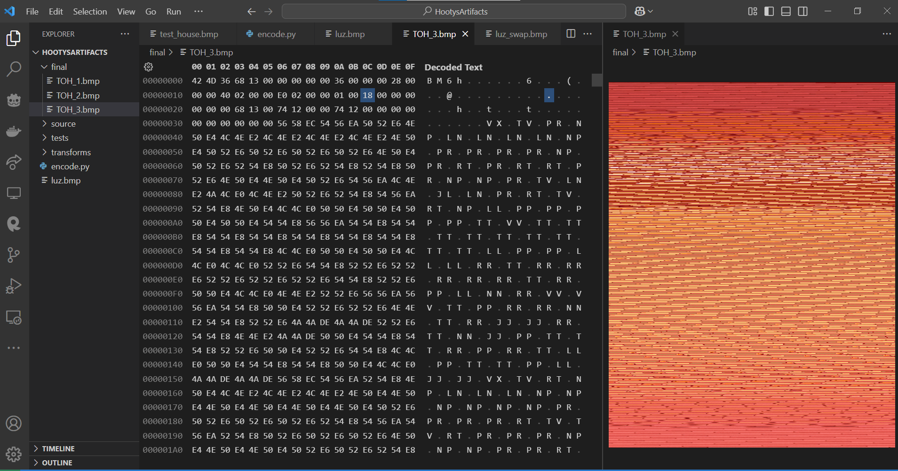

Les couleurs semblent "normales" maintenant (bien que c'est assez rouge...), mais les lignes sont encore non-alignées.
En inversant la hauteur et longueur comme à l'image 2, nous retrouvons l'image.

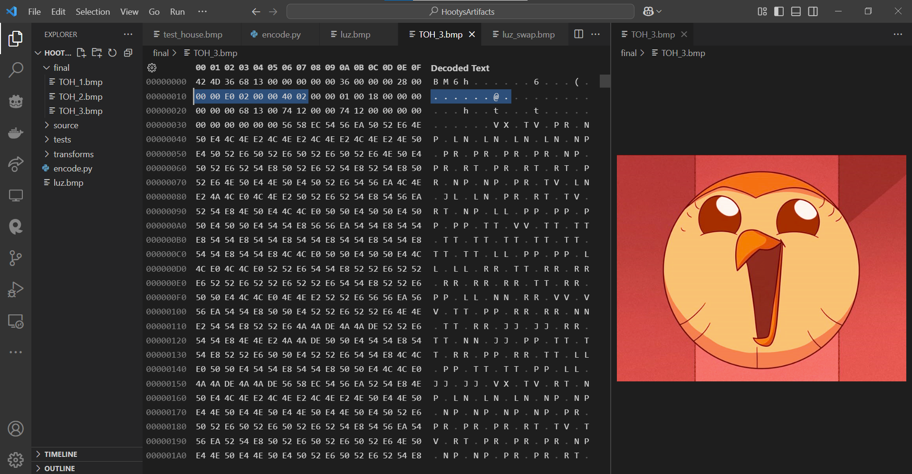

**Mais ce n'est pas tout!** Comme dans beaucoup de défis de stéganographie, le flag est caché dans l'image.

Le secret était caché dans le bec de Boubou (/Hooty), dans les bits les moins significatifs de l'image. Plusieurs outils existent pour détecter ce genre de secrets, par exemple https://www.georgeom.net/StegOnline/image .

On charge l'image, puis en allant sur `Browse bit planes` :

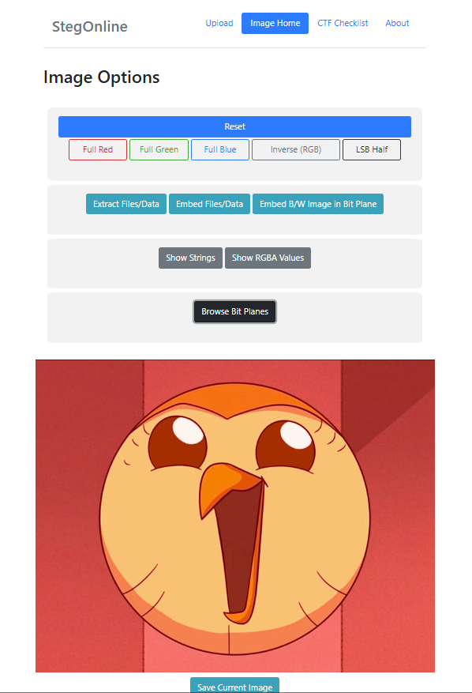

Nous devons aller sur les bits les moins significatifs de la couleur rouge (l'image avait été rendue plus rouge comme indice par rapport à cela), et nous verrons le flag apparaître:

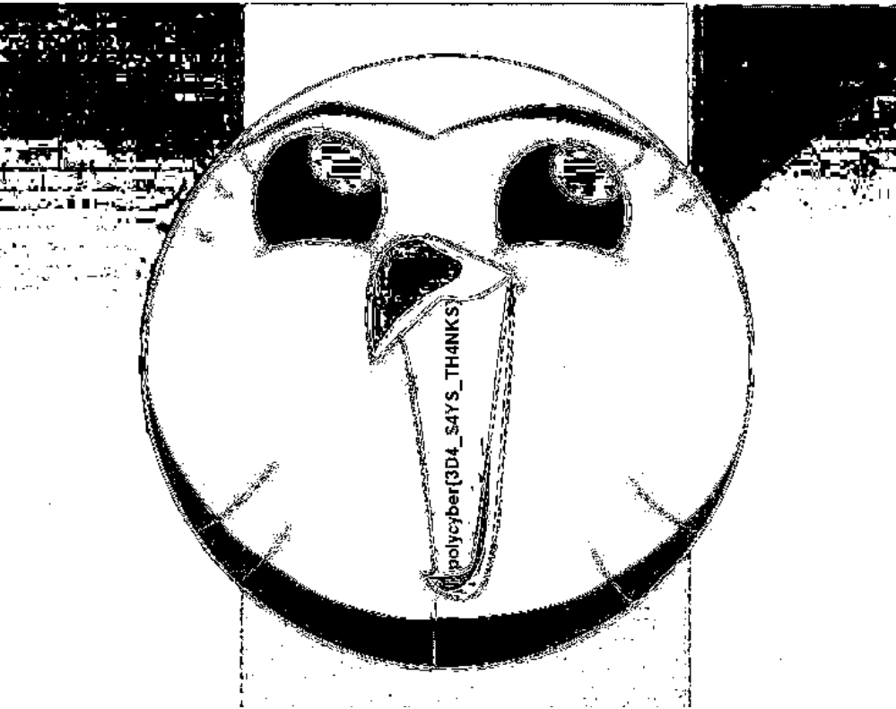

(L'image exacte peut varier en fonction des navigateurs ou des outils).

Et c'est tout, merci d'avoir lu ce write-up :D

## Flag

`polycyber{3D4_S4YS_TH4NKS}`