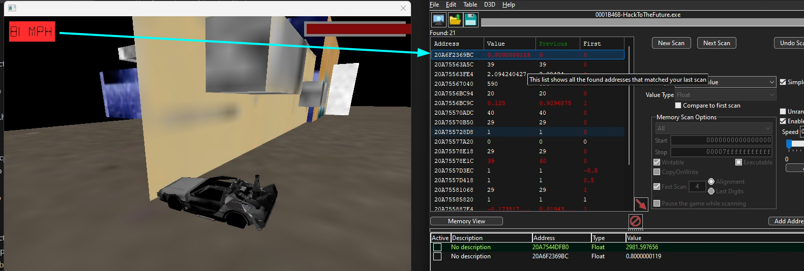
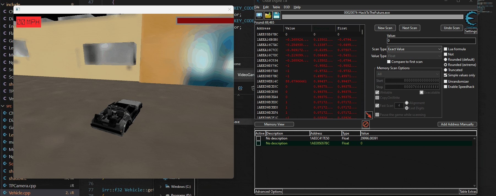
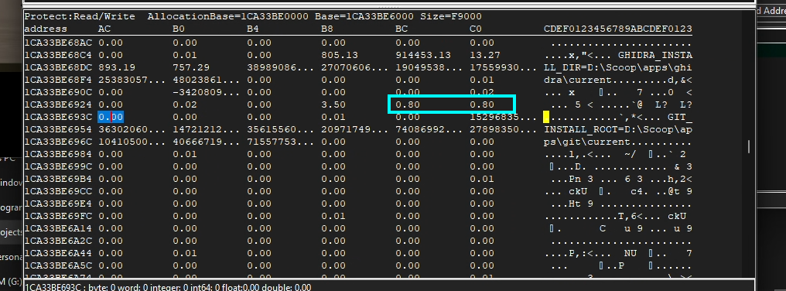
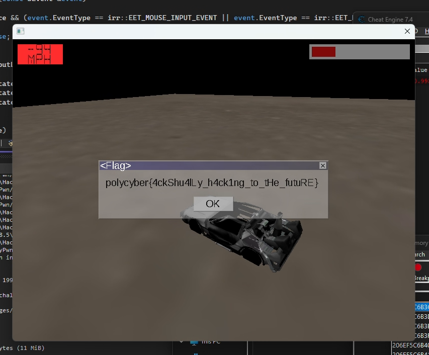

# HackToTheFuture - Critical Speed writeup

By opening the game with Cheat Engine, we can try to search for the speed with fuzzy matching. This is done with the following steps:
1. Go to high speed
2. Slow down game to maximum using Cheat Engine speedhack
3. Search for 'Value increased'
4. Remove speedhack
5. Lower speed
7. Enable speedhack
6. Search for 'Value decreased'
7. Disable speedhack
8. Repeat

By following these steps, we should end up with an interesting value in one of the fields.

However, modifying the value doesn't seem to do much.

This probably means the value is clamped, or checked by the game. Usually, these limits can be found around the value itself. Indeed, by looking at the neighbouring memory of the value as `float`s, we can see the upper bound of the speed two times:

We can then modify these bounds, and play the game and see our car can go as fast as it wants.
