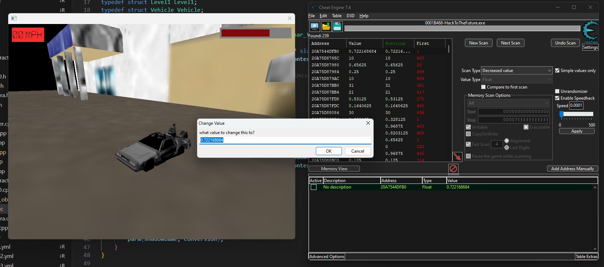
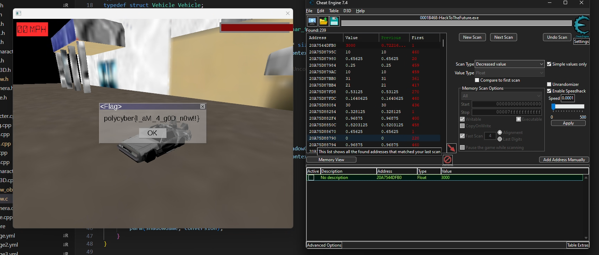

# HackToTheFuture - Godmode writeup

By opening the game with Cheat Engine, we can try to search for the speed with fuzzy matching. This is done with the following steps:
1. Slow down game to maximum using Cheat Engine speedhack
2. Search for 'Value decreased'
3. Search for 'Value unchanged' for a couple times
4. Remove speedhack
5. Wait for health decrease
8. Repeat

By following these steps, we should end up with an interesting value in one of the fields.

By changing the value to an absurdly large number, we can achieve infinite health, giving us the flag.
