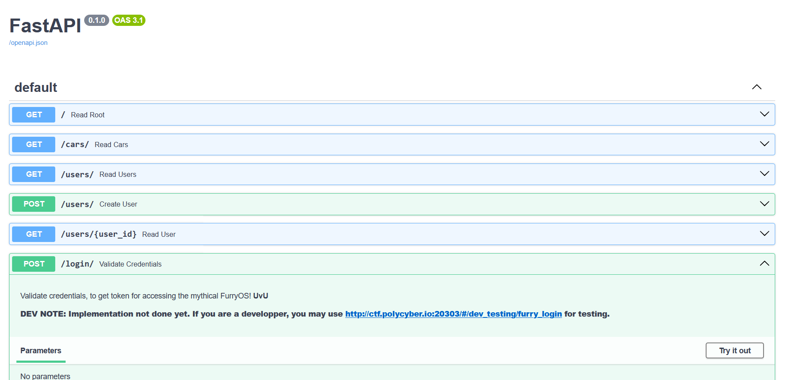

# Fast and FurryOS

## Write-up FR

### Flag 1) La page About interminable

Allez sur la page "About", et vous verrez un trèèèès long carroussel d'images.

En défilant jusqu'à la fin, vous allez trouver une image avec le premier flag `polycyber{JUST_K33P_SCR0LL1NG}`.

Le *scroll* horizontal est cool! Mais l'intention première était de montrer qu'il est toujours utile de récolter de l'information (de manière non destructive) dans un site web. Cela inclut les pages autres que la page principale, comme les informations de technologies utilisées.

### 2) The FastAPI docs

Dans la barre du bas, on trouve une information intéressante sur les technologies : `Powered by FastAPI (dev mode)`.

C'est souvent une bonne idée de faire un peu de recherche sur les technologies rencontrées. En faisant ça on apprend que FastAPI est un service HTTP en Python.

Le texte contient la mention `dev mode` qui est un indice pour chercher plus loin. Des recherches plus approfondies vont montrer que FastAPI peut contenir une page de documentation, généralement au chemin `/docs`.

La fenêtre de réseau de notre navigateur nous permettra de trouver l'addresse du serveur, et en ajoutant `/docs` on verra que la documentation existe effectivement!

Le deuxième flag est ensuite dans la description de la route "Create user", et c'est `polycyber{D0NT_K33P_D3V_4RT1F4CTS_1N_PR0DUCT10N}`.

### 3) The Secret Login

En essayant la route qui récupère tous les utilisateurs, nous tombons sur un nom suspect, "Flagster".

La page de documentation montre également une route de login non implémentée, avec un indice vers une page en développement: `http://ctf.polycyber.io:20303/#/dev_testing/furry_login`.

La page "secrète" a un formulaire de connexion, et en effectuant du *fuzzing* (c'est-à-dire l'envoi de caractères aléatoires) nous voyons que le serveur renvoit les erreurs, ce qui signifie qu'il y a de l'information dévoilée par le serveur! En lisant les erreurs nous pouvons déduire qu'une injection SQL est possible.

En investiguant différentes injections, nous voyons qu'il est possible d'utiliser des fonctions `SELECT` pour récupérer des informations de la base de donnée, grâce à des *Union-based SQL injections*.

Il faut voir à travers les tests que la requête s'attend en fait à recevoir 2 chaînes de caractères en retour, qui sont affichés à l'écran après le login.

Ainsi, il faut trouver le nom secret de Flagster grâce à l'injection suivante ou une autre équivalente : `")) union select user.name, user.secret_name from user where user.name="Flagster" -- ` et *voilà*! Nous avons le dernier flag, `polycyber{5QL_1NJ3CT10N5_4R3_0V3RR4T3D}`.

## Write-up EN

### Flag 1) The unending About page

Head to the about page, and you will find a veeery long carrousel.

Scroll right to the end, and you will find a picture with the flag `polycyber{JUST_K33P_SCR0LL1NG}`.

Side scrolling is cool! But this was primarily intended to show that it is always useful to gather information (non destructively) from a website outside of the main page, for more information on the site, technologies used, to have more intel.

### 2) The FastAPI docs

In the bottom bar, you will find some interesting information on the tech stack: `Powered by FastAPI (dev mode)`.

It is always a good idea to do some research on the technologies used. Doing so, you will find that FastAPI is an http backend in Python.

There is a hint in the text saying `dev mode`, so further search will show that FastAPI has a documentation to help with development, and it is usually at the `/docs` route.

Looking at the browser's network tab, you will find that the server's address, and adding `/docs` to that path you will find it is available!

The second flag is then found in the description of the "Create user" route, `polycyber{D0NT_K33P_D3V_4RT1F4CTS_1N_PR0DUCT10N}`.

### 3) The Secret Login

The FastAPI's `/docs` has a route available that lets you get all users, and so you can see that there is a suspicious user named Flagster...

The documentation page also shows a login route that is not implemented, with a hint towards an under development dashboard, `http://ctf.polycyber.io:20303/#/dev_testing/furry_login`.

This "secret" page has a login form, and we see by fuzzing (aka sending random characters, for example ") that errors are printed, therefore we are getting information leakage from the server! Reading the errors lets us know that there is an sql injection possible!

After investigation with the injection, we can find that it is possible to select other users' name and secret names (or other fields) through a union select.

Finally, testing many select injections we can determine that the request expects 2 strings as results, which are printed to the message after login.

Therefore, one possible injection to get the Flagster's secret name is : `")) union select user.name, user.secret_name from user where user.name="Flagster" -- ` and *voilà*! We get the flag `polycyber{5QL_1NJ3CT10N5_4R3_0V3RR4T3D}`.

## Flags

1. `polycyber{JUST_K33P_SCR0LL1NG}`
2. `polycyber{D0NT_K33P_D3V_4RT1F4CTS_1N_PR0DUCT10N}`
3. `polycyber{5QL_1NJ3CT10N5_4R3_0V3RR4T3D}`
