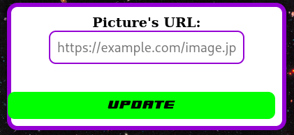
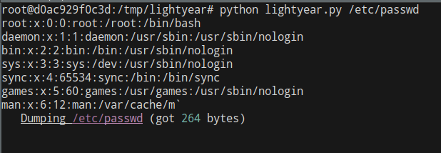
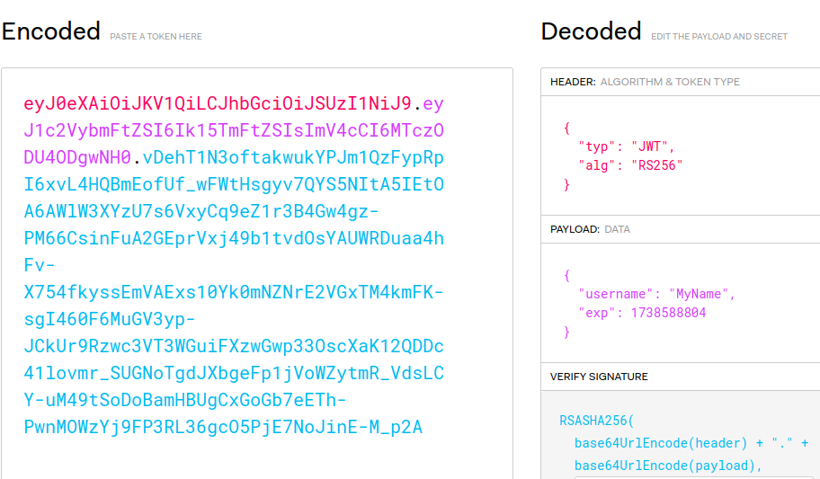
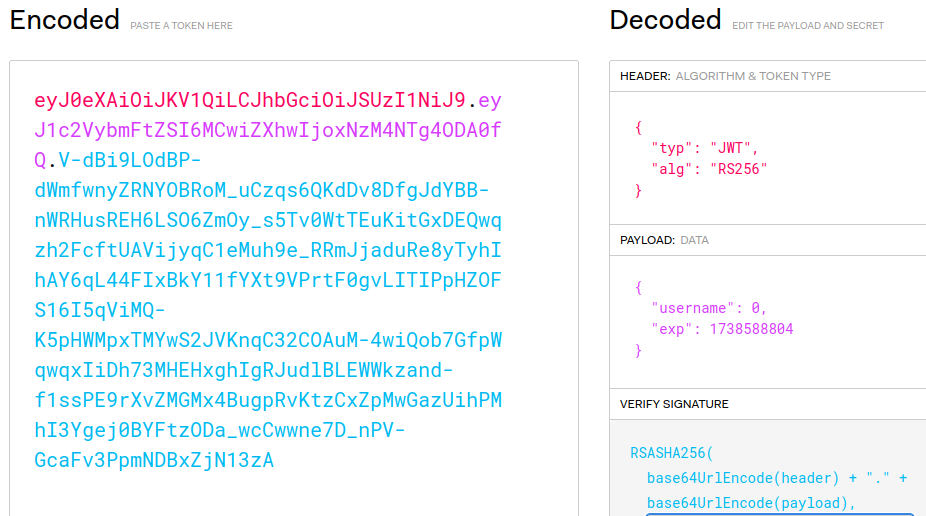

# Star Command

## Write-up FR

Ici, l'énoncé nous demande de reprendre le contrôle du site web de Star Command.
Première étape : Explorer ce site.

### Contenu du site

Entre les pages en `.php` et les headers du serveurs, on connait déjà à coup sûr le langage utilisé (PHP, au cas où).
On retrouve clairement 6 pages :
- `index.php` : La homepage
- `about.php` : Une simple présentation de Star Command
- `login.php` : Un formulaire de connexion
- `register.php` : Un formulaire d'inscription au site
- `profile.php` : Une page de profil
- `logout.php` : Une page de déconnexion

Les pages qui semblent clairement interactives sont celles de connexion, inscription et le profil.
On peut essayer autant que l'on veut des injections SQL sur les 2 premières, rien ne se passera (en théorie).

Cependant, le profil est plus intéréssant.

### Le profil

2 choses ressortent sur le profil :
- La carte d'identité de ranger de l'espace


Le nom du compte créé est réfléchi, et non nettoyé, donc on peut effectuer des injection XSS.

- Le formulaire d'update d'image


En effectuant quelques tests sur ce formulaire, on se rend compte que même si le serveur rejette notre image, une requête est bien effectuée.
Pour vérifier cela on peut effectuer une requête vers notre machine, serveur, ou vhttps://github.com/synacktiv/php_filter_chain_generatoria un burp Collaborator.
Il semblerait même que nous ayons affaire à une File Inclusion primitive.

### La File Inclusion

Nous avons donc une entrée qui accepte les PHP Filters, qui effectue bien les requêtes, mais qui ne nous donne aucun retour.
Heureusement pour nous, une attaque existe la dessus : [les PHP Filters chain](https://www.synacktiv.com/en/publications/php-filters-chain-what-is-it-and-how-to-use-it).

Pour résumer : Il est possible de lire un fichier sans avoir aucun retour, donc "à l'aveugle" via des PHP Filters chaînés.
Et pas besoin de coder l'outil nous-même, il existe : [https://github.com/synacktiv/php_filter_chain_generator](https://github.com/synacktiv/php_filter_chain_generator)

Cependant, on est là sur une solution assez lente, ce qui est pas optimal (surtout dans un CTF limité en temps).

Mais Buzz **Lightyear** est là pour nous. Ou plutôt [ambionics](https://www.ambionics.io/blog/lightyear-file-dump) avec leur super outil [lightyear](https://github.com/ambionics/lightyear) !

On modifie legerement le script pour être sûr qu'il fonctionne et qu'il soit adapté à notre challenge et on peut commencer à lire les fichiers



Et on peut commencer à récupérer tous les fichiers php.

### Forger son propre cookie

Si on est attentif, on remarque depuis le début que notre cookie est un JWT, en RS256 donc signé.


Mais maintenant que nous pouvons lire des fichiers, on peut aussi récupérer la clef privée `/private.key`, et donc forger nos propre cookies et les signer !
Tout cela peut se faire simplement à travers (jwt.io)[https://jwt.io].

Oui mais, que devons-nous mettre dans ce cookie ?

### L'exploit du MySQL

Dans la page `profile.php` on retrouve ce snippet de code :
```PHP
$username = decode_jwt($_COOKIE['PHP_SESSION']);
$stmt = $pdo->prepare('SELECT * FROM users WHERE username = :username and is_admin=1');
$stmt->bindValue( ':username',$username,getPdoParamType($username));
$stmt->execute();
$user = $stmt->fetch(PDO::FETCH_ASSOC);

if ($user){
    $role = "Administrator";
    $photoPath = $user['profile_picture'];
    $displayName = $user['username'] . ' Lightyear';
} else if (!is_null($username)){
    $role = "Space Ranger";
    $photoPath = "assets/space_ranger.png";
    $displayName = $username . ' Lightyear';
}
```

C'est ici que se fait la vérification de notre rôle, et nous voulons être Administrateur. Mais il s'agit d'une requête préparée et aucune injection SQL n'est possible.
Cependant, une fonction peut nous paraître étrange : `getPdoParamType()`

en la cherchant, on découvre quelle est définie par le dev dans le fichier `cookie_decode.php`
```PHP
function getPdoParamType($value) {
    return match (gettype($value)) {
        'integer' => PDO::PARAM_INT,
        'boolean' => PDO::PARAM_BOOL,
        'NULL'    => PDO::PARAM_NULL,
        default   => PDO::PARAM_STR
    };
}
```

On peut clairement donner une entrée de n'importe quel type autre que `string` pour notre `username`.
Ce qui est plutôt arrangeant, car il existe sur MySQL une vulnérabilité qu'on associe plutôt à PHP : du **Type Juggling** 


Puisque notre requête SQL récupère uniquement les utilisateurs admin avec le `is_admin=1`, alors il faut juste trouver une valeur qui pourra valider `username`.
Nous avons ici 2 possiblités :
- Le username commence par une lettre, donc une vérification avec `False` ou `0` fonctionnera
- Le username commence par un nombre, donc il faut donner ce même nombre (par exemple `"42admin" = 42` )

Commençons par la méthode la plus simple :


Et bingo, on est connecté en tant qu'admin !


## Write-up EN

Here, we're asked to take control of the Star Command website.
First step: Explore the site.

###  Site content

With the `.php` pages and the server headers, we already know the language used (PHP, just in case).
There are clearly 6 pages:
- `index.php` : The homepage
- `about.php` : A simple presentation of Star Command
- `login.php` : A login form
- `register.php` : A registration form
- `profile.php` : A profile page
- `logout.php` : A logout page

The pages that seem clearly interactive are the login, registration and profile pages.
You can try as many SQL injections as you like on the first 2, but nothing will happen (in theory).

However, the profile is more interesting.

### The profile

2 things stand out on the profile:
- The space ranger ID card


The name of the account created is thought out, and not cleaned up, so XSS injections can be performed.

-  The image update form


When we run a few tests on this form, we realise that even if the server rejects our image, a request is still made.
To check this we can make a request to our machine, server, or a burp Collaborator.
It would even appear that we are dealing with a primitive File Inclusion.

###  File Inclusion

So we have an entry which accepts PHP Filters, which makes requests, but which doesn't give us any feedback.
Fortunately for us, there is an attack on this: [PHP Filters chain](https://www.synacktiv.com/en/publications/php-filters-chain-what-is-it-and-how-to-use-it).

To sum up: it's possible to read a file without getting any feedback, i.e. 'blind' via chained PHP Filters.
And there's no need to code the tool ourselves, it exists: [https://github.com/synacktiv/php_filter_chain_generator](https://github.com/synacktiv/php_filter_chain_generator)

However, this is a fairly slow solution, which is not optimal (especially in a time-limited CTF).

But Buzz **Lightyear** is there for us. Or rather [ambionics](https://www.ambionics.io/blog/lightyear-file-dump) with their super tool [lightyear](https://github.com/ambionics/lightyear)!

We modify the script slightly to make sure it works and is adapted to our challenge and we can start reading the files


And we can start recovering all the php files.

###  Forging your own cookie

If you're paying attention, you'll notice from the start that our cookie is a JWT, in RS256 and therefore signed


But now that we can read files, we can also recover the private key `/private.key`, and therefore forge our own cookies and sign them.
All this can be done simply through [jwt.io](https://jwt.io).

But what should we put in this cookie?

### The MySQL exploit

In the `profile. php` we find this code snippet:
```PHP
$username = decode_jwt($_COOKIE['PHP_SESSION']);
$stmt = $pdo->prepare('SELECT * FROM users WHERE username = :username and is_admin=1');
$stmt->bindValue( ': username',$username,getPdoParamType($username));
$stmt->execute();
$user = $stmt->fetch(PDO::FETCH_ASSOC);

if ($user){
 $role = "Administrator
 "; $photoPath = $user['profile_picture
 ']; $displayName = $user['username'] . ' Lightyear';
} else if (!is_null($username)){
 $role = "Space Ranger
 "; $photoPath = "assets/space_ranger.png
 "; $displayName = $username . ' Lightyear';
}
```

This is where we check our role, and we want to be Administrator. But this is a prepared statement and no SQL injection is possible.
However, one function may seem strange: `getPdoParamType()`

When we look for it, we discover that it has been defined by dev in the `cookie_decode. php`
```PHP
function getPdoParamType($value) {
 return match (gettype($value)) {
 'integer' => PDO::PARAM_INT,
 'boolean' => PDO::PARAM_BOOL,
 'NULL' => PDO::PARAM_NULL,
 default => PDO::PARAM_STR
 };
}
```

We can clearly give an entry of any type other than `string` for our `username`.
Which is rather convenient, because there is on MySQL a vulnerbilities usually associated with PHP : **Type Juggling**


Because are SQL code only requests admin users with the `is_admin=1`, we only have to find a value that can validate `username`.

We got 2 posssibilites :
- The username starts with a letter, so a verification with `False` or `0` will work
- The username starts with a number, so we have to send this same number (for example `"42amdin" = 42` )

Let's start with the simpliest method


And bingo, we are connected as an admin !


## Flag

`polycyber{BuzzLightyear_to_Star_Command!I_found_a_type_juggling!}`
